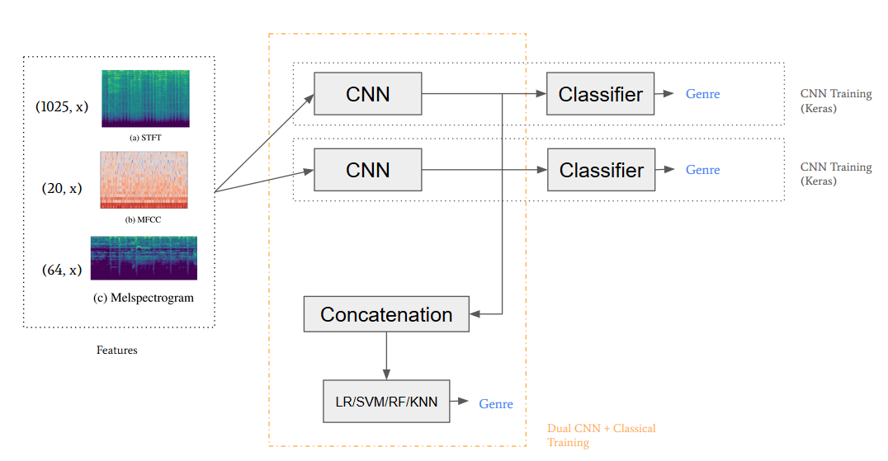
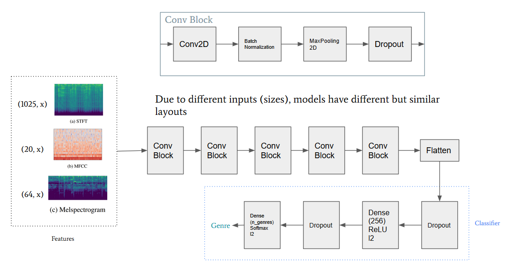

# Dual Spectrogram Input for Music Genre Classification

Achieved **95.8**% on GTZAN using a Dual CNN + KNN model with STFT and Melspectrogram input.\
Achieved **92.4**% on Extended Ballroom using a Dual CNN + SVM model with STFT and MFCC input.

The models are not included in this repository but can be [downloaded](https://drive.google.com/drive/folders/1bwOtg4QYzKRave24x3r-mbmLlapgBfkH?usp=sharing).

More information can be found by looking at the main [notebook](Music_Genre_Classification.ipynb) and the [paper](Final_Paper.pdf).

## Dual CNN Framework

## CNN Architecture
